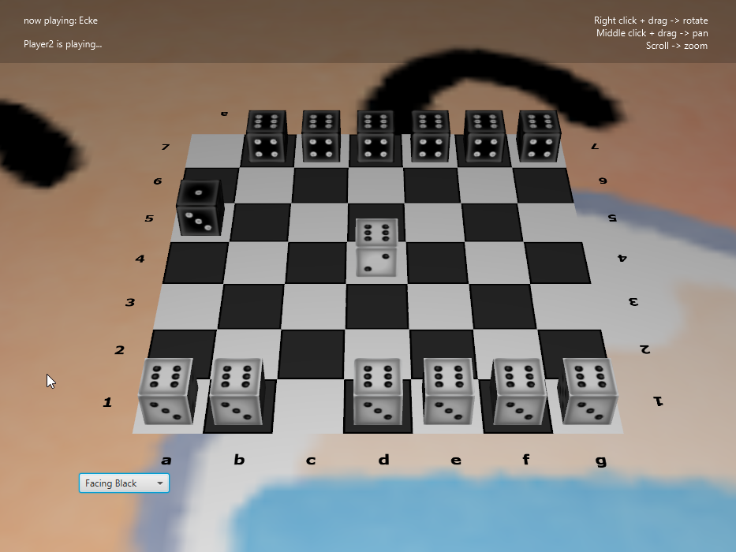

Cublino ECKE (Derived from the German word for 'Corner') is our group's implementation of a new gametype (Task 15), using the same core principles which underpin the existing Pur and Contra Variants.
It is designed to be  a fast paced and exciting variant which combines strategies from both Pur and Contra. The rules and objective for such are outlined below.

## OBJECTIVE: 
The aim of 'Ecke' is to reach each of your opponent's corners with one die each. The first player to do so is crowned as the winner. As will be outlined in the battle rules, a game may also be won if your opponent has fewer
than 2 dice to play with. Below is an example of a game that has been won by Player 1 (White).

### MOVEMENT RULES: 
'Ecke' has a very diverse movement rule base. Foremost, all moves allowed in Pur (Perpendicular Tilts and Jumps) are allowed in Ecke 
with the same conditions (i.e. Ends must be unoccupied, jumps must be over a dice). In addition to this,
Ecke incorporates diagonal tilts and jumps. In all cases, movement can either be sideways or towards the opponent's end of the board, never backwards. 
A situation where a diagonal tilt is possible is shown below;

The white dice on d3 is able to tilt to e4 or c4 (in addition to the normal tilt possibilities). 
Whenever a diagonal tilt is completed, the dice will also change orientation. This is done by consider the edge of the cube which is 
in the direction of the diagonal tilt. In the above case, if the move 'd2e4' is played, then we consider the NORTH-EAST edge
The dice will roll over this edge so that the bottom and top number switch places. Below is resultant boardstate after the aforementioned tilt is completed;

Note that if we took the diagonal tilt in the other direction (NW) then this would only alter the numbers on the side.

Diagonal Jumps follow a similar convention to jumps in Pur. That is, as long as a dice occupies a diagonal tilt position for a dice,
then the dice is able to jump over it. Below is an example;

The dice on f3 is able to make the diagonal jump move f3d5.

### BATTLE RULES: 
When a move is completed, a battle will take place if the move is in the vicinity of an opponent die. Vicinity 
is defined to be all the locations that are reachable by a tilt of the dice in question. For the example below,
the vicinity of the black dice on d4 is outlined by the red square.

If a move's end position is in the vicinity of multiple dice then multiple battle's occur.
Unlike Contra, battles are fought on a 1v1 basis, that is, for each individual battle, only the top number will decide
who's decide is removed. However, if a player moves into a position where multiple battles take place, they must win all of them
for opponent dice to be removed. That is, if they lose to even one dice, then their dice is simply removed. This is to avoid being able to
'suicide' your own dice to remove an opponent's. For example, consider the case below

If white were to play 'c2d3' then two battles will occur, one with the black dice on 'd4' and one with the 'e4' dice.
As outline above, the move 'c2d3' results in the number '4' being on top for the white dice, meaning on an individual level;
it loses to the 'd4' dice but beats the 'e4' dice. However, by convention, in this scenario, the 'd4' dice 'protects' its peer and
only the white dice is removed if this move is played.

A battle will only not occur if a move's end position is one of the opponent's corners. This is to avoid 'camping' these areas with a 
6-top-faced die.

And thus this concludes the core rules of the game. Please Enjoy!