# COMP1140 Assignment 2

## Academic Honesty and Integrity

Honesty and integrity are of utmost importance. These goals are *not* at odds with being resourceful and working collaboratively. You *should* be resourceful, you should collaborate within your team, and you should discuss the assignment and other aspects of the course with others taking the class. However, *you must never misrepresent the work of others as your own*. If you have taken ideas from elsewhere or used code sourced from elsewhere, you must say so with *utmost clarity*. At each stage of the assignment you will be asked to submit a statement of originality, either as a group or as individuals. This statement is the place for you to declare which ideas or code contained in your submission were sourced from elsewhere.

Please read the ANU's [official position](http://academichonesty.anu.edu.au/) on academic honesty. If you have any questions, please ask me.

Carefully review the statement of originality which you must complete at each stage.  Edit the relevant statement and update it as you complete each stage of the assignment, ensuring that when you complete each stage, a truthful statement is committed and pushed to your repo.

## Purpose

In this assignment you will work as a group to master a number of major themes of this course,
including software design and implementation,
using development tools such as Git and IntelliJ, and using JavaFX to build a user interface.
As an extension task, you may also explore strategies for writing agents that play games.
Above all, this assignment will emphasize group work; 
while you will receive an individual mark for your work based on your contributions to the assignment,
you can only succeed if all members contribute to your group's success.

## Assignment Deliverables

The assignment is worth 30% of your total assessment, and it will be marked out of 30.
So each mark in the assignment corresponds to a mark in your final assessment for the course.
Note that for some stages of the assignment you will get a _group_ mark, and for others you will be _individually_ marked.
The mark breakdown and the due dates are described on the [deliverables](https://cs.anu.edu.au/courses/comp1110/assessments/deliverables/) page.

Your work will be marked via your tutor accessing Git, so it is essential that you carefully follow instructions for setting up and maintaining your group repository.
At each deadline you will be marked according to whatever is committed to your repository at the time of the deadline.
You will be assessed on how effectively you use Git as a development tool.

## Problem Description
Your task is to implement in Java, using JavaFX, a board game called Cublino,
made by games developer [Intellego](http://www.intellego-holzspiele.de/en/index.html).   Fortunately, the rules of the game are surprisingly simple.  Unfortunately there does not appear to be a good description in English.   There is a nice overview [here](https://www.brettspiele-report.de/cublino/) in German which includes illustrations of important scenarios.

## Game Rules
Cublino is a two player game where each player controls seven dice. Players alternate turns moving their dice attempting to reach the opponent's end of the board. There are two variants of the rules: Cublino Contra and Cublino Pur. Each variant has slightly different rules and winning conditions. For the main task of the assignment you will be implementing the Cublino Pur variant, with an option to implement Cublino Contra as an additional task at the end of the assignment. All images used in this section are taken from [https://www.brettspiele-report.de/cublino/](https://www.brettspiele-report.de/cublino/).

## Game setup

The game is set up with each player placing their seven dice on their respective ends of the board with the six facing up and the three facing towards themselves (and the four facing the towards the opponent). Both variants are set up in the same way.

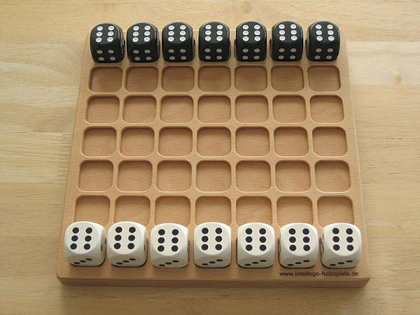

### Playing the Game

#### Cublino Pur

In Pur, on a player's turn they select one die to move. They may then move that dice in a sequence of steps which make up the move. There are two types of steps: 
 - A tipping step where the die is tilted along its edge either forwards or horizontally. The die should be rotated 90 degrees in the direction of the step such that a new number is facing upwards.

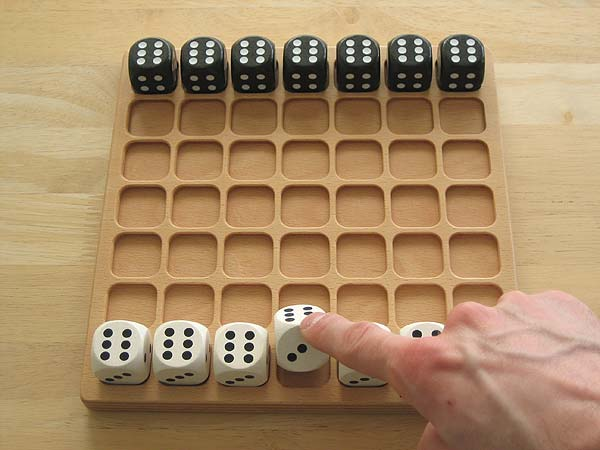

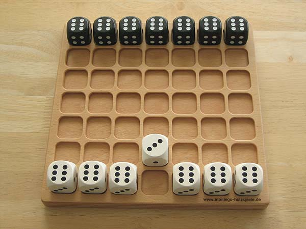
   
 - A jumping step, where the die jumps over another singular die either immediately forwards, left, or right. The die is not rotated through a jumping step. If the space behind the adjacent die is not empty the player may not jump in that direction.

Steps are combined into moves as follows:
 - A move must consist of at least one step.
 - Only the first step in a move may be a tipping step, however, the first step in a move doesn't need to be a tipping step. If the player chooses to make a jumping step first then they may only make jumping steps for the rest of the move.

| 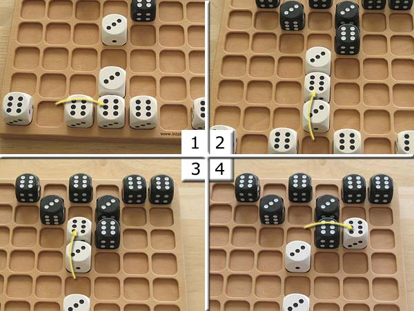 |
| :---: |
| A move starting and continuing with a sequence of jumping steps. |

| 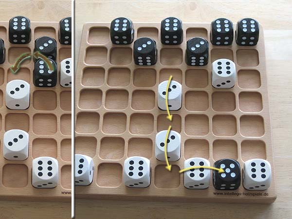 |
| :---: |
| A move starting with a tipping step followed by a sequence of jumping steps. |

Once a player has completed the series of steps making up their move the turn is passed to the other player. If a player has no legal moves their turn is skipped and the other player must make another move. If no player has legal moves available, and the game is not finished the result is a draw (see the next section for the rules to finishing a game).

##### Finishing the Game

A game of Cublino Pur is over once a player has reached the opponent's end of the board with all seven of their dice. Each player then adds the upward facing numbers on their dice which have reached the opponent's end of the board (any dice which are not at the opponent's end of the board are excluded from the total). The player with the higher total wins.

| 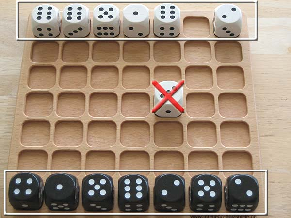 |
| :---: |
| In this example the white player scores 26 and the black player scores 25. |

#### Cublino Contra

In Contra players move by tipping their dice along an edge either forwards, left or right. In Contra all move consist of a single tipping step, jumping steps are not permitted. If the moved dice is adjacent to the opponent's dice after the move a battle occurs. A battle is resolved by adding the numbers on the upwards faces of all adjacent dice belonging to the opponent of the two dice in the battle. Two dice are considered adjacent if they are directly touching along one side (So a dice can be adjacent to up to four other dice). The player with the lower score loses the battle and their dice is removed. If the totals are equal no dice are removed as a result from the battle. For example, if white has just move a die (the attacker), and it is adjacent to a black die (the defender) then white's score in the battle is calculated by adding the numbers on the top faces of all white dice adjacent to the defending black die and black's score is calculated by adding the numbers on the top faces of all black die ajdacent to the attacking white die. Only the attacking or defending dice are removed, not any others which contributed to the total. If a moved dice is adjacent to more than one opponent's dice multiple battles occur. The outcome of each battle is determined separately before any dice have been removed. Once all battles have been resolved the losing dice are removed.

| 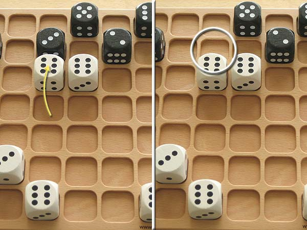 |
| :---: |
| White moves the die as shown and is now adjacent to a black die. White's total is six and black's total is three. Black loses the battle and their dice is removed.

| 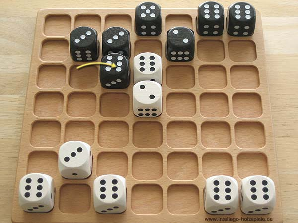 |
| :---: |
| Black moves the die as shown and is now adjacent to a white dice. The total for both players is six so no dice are removed.

| 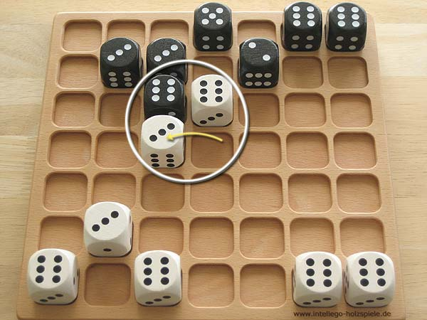    |
| :---: |
| White moves the die as shown. White's total is nine (6 + 3) and black's total is six. Black loses and their dice is removed.

| 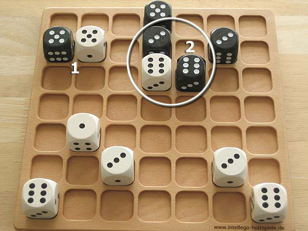 |
| :---: |
| The battle marked 1 is tied so no dice are removed. In the battle marked 2 white's total is six and black's total is nine so the white dice would be removed. |

If a player has no legal moves their turn is skipped and the other player must make another move. If no player has legal moves available, and the game is not finished the result is a draw (see the next section for the rules to finishing a game).

##### Finishing the Game

The first player who reaches the opponent's end of the board with one of their dice wins the game.

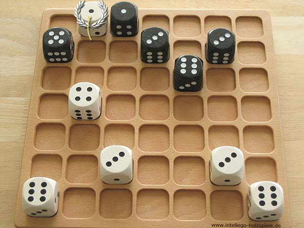

#### Never Ending Game

In both variants it is possible for the game to last forever, for example if both players just move a dice horizontally back and forth without moving forwards. The tasks of the assignment do not consider this scenario however as part of task 14 you may introduce a rule to check when players are stalling the game and end the game with a draw. How you define this is up to you (should you choose to implement it) as long as it does not conflict with the existing rules as stated above.

### Encoding Game State

In order to test your implementation of the game we have designed a standardised interface for our testing functions. This interface encodes the game `state` as a string.

The first character of the string is either the letter `p` or the letter `c` indicating which set of rules the game state is using. The case of the letter indicates which player's turn it is. An upper case letter indicates it's player one's turn, and a lower case letter indicates player two. If a move is played that ends the game, the case of this character is determined by the player who would have played next had the game not ended.

The rest of the `state` string consists of groups of three characters indicating the positions and orientations of the various dice on the board.

#### Encoding a Die

Each die is represented as a three character string as follows:
- `1st` character is the orientation and the owner (See below for encoding)
- `2nd` character is the column of the die represented as a character from `a`-`g`
- `3rd` character is the row of the die represented as a character from `1`-`7`

The white dice start in row `1` and the black in row `7`.

##### Die Orientation

The orientation of the die is encoded as a character from `a`-`x`. The case of the character determines the player the die belongs to. An upper case character indicates the dice belongs to player one, a lower case character indicates that it belongs to player two.

The dice orientations are numbered sequentially, first by the number facing upwards, then the number facing forwards (towards row `7` of the board). The following rules allow for all dice faces to be determined:
- The numbers on the opposite sides of a die sum to seven
- The dice used in this game are known as 'right-handed'. This means if the number one is facing up and the number two is facing away from you, the number three will be on the left face of the die. All dice provided by the course have this orientation as do most western dice. If you are using your own dice to visualise the placement of the faces please check they have this arrangement.

For example, the character `A` indicates the dice belongs to player one, the number on the top face is one and the number on the forward face is two (the lowest available number as there cannot be two faces with one on them). The character `b` indicates the dice belongs to player two, the number on the top face is one and the number on the forward face is three. The character `e` indicates the orientation where the top face is two and the forward face is one (the lowest number of those on the side of the die). The character `f` indicates the orientation where the top face is two and the forward face is three (the next lowest number of those on the side of the die as the two is already facing upwards).

The starting orientation of the white dice encoded as `W` and the starting orientation of the black dice is encoded as `v`.

#### Encoding a Move

A step is encoded as a four character string. The first two characters are the starting location of the step. The third and fourth characters are the ending location of the step. Each pair of characters encodes a position using the same format as the second and third characters of a die encoding. A move is encoded as a sequence of positions where each pair of positions indicates a step.

## Use Your Creativity!

Software development is fundamentally a creative exercise.   You are building something new.   This is all the more
true when you are creating a game with a GUI.   You are encouraged to be creative in this assignment.   There are 
some well-defined specifications which you must abide by, but outside of that there is a great deal of scope for
creativity.  Have fun!

## Legal and Ethical Issues

First, as with any work you do, you must abide by the principles of [honesty and integrity](http://academichonesty.anu.edu.au).
We expect you to demonstrate honesty and integrity in everything you do.

In addition to those ground rules, you are to follow the rules one would normally be subject to in a commercial setting.
In particular, you may make use of the works of others under two fundamental conditions: 
a) your use of their work must be clearly acknowledged, and 
b) your use of their work must be legal (for example, consistent with any copyright and licensing that applies to the given material).
*Please understand that violation of these rules is a very serious offence.* 
However, as long as you abide by these rules, you are explicitly invited to conduct research and make use of a variety of sources.
You are also given an explicit means with which to declare your use of other sources (via originality statements you must complete).
It is important to realize that you will be assessed on the basis of your original contributions to the project.
While you won't be penalized for correctly attributed use of others' ideas, the work of others will not be considered as part of your contribution.
Therefore, these rules allow you to copy another student's work entirely if: 
a) they gave you permission to do so, and 
b) you acknowledged that you had done so.
Notice, however, that if you were to do this you would have no original contribution and so would receive no marks for the assignment (but you would not have broken any rules either).

## Evaluation Criteria

It is essential that you refer to the [deliverables page](https://cs.anu.edu.au/courses/comp1110/assessments/deliverables/) to check that you understand each of the deadlines and what is required.
Your assignment will be marked via tests run through GitLab's continuous integration (CI) framework, so all submittable materials will need to be in your GitLab repository in the *correct* locations, as prescribed by the [deliverables page](https://cs.anu.edu.au/courses/comp1110/assessments/deliverables/).

**The mark breakdown is described on the
[deliverables](https://cs.anu.edu.au/courses/comp1110/assessments/deliverables/) page.**

### Part One

In the first part of the assignment you will:
* Set up your assignment (Task #1).
* Create a design skeleton (Task #2).
* Implement parts of the text interface to the game (Tasks #3, and #4).
* Implement a simple viewer that allows you to visualize game states (Task #5).

An indicative grade level for each task for the [completion of part one](https://cs.anu.edu.au/courses/comp1110/assessments/deliverables/#D2C) is as follows:

**Pass**
* Tasks #1, #2, #3 and #4

**Credit**
* Task #5 *(in addition to all tasks required for Pass)*

**Distinction**
* Task #6 and Task #7 *(in addition to all tasks required for Credit)*

### Part Two

Create a fully working game, using JavaFX to implement a playable graphical version of the game in a 933x700 window.

Notice that aside from the window size, the details of exactly how the game looks etc, are **intentionally** left up to you.
The diagrams above are for illustrative purposes only, although you are welcome to use all of the resources provided in this repo, including the bitmap images.

The only **firm** requirements are that:

* you use Java 15 and JavaFX,
* the game respects the specification of the game given here,
* the game be easy to play,
* it runs in a 933x700 window, and
* that it is executable on a lab computer or the VDI from a JAR file called `game.jar`,

Your game must successfully run from `game.jar` from within another user's (i.e. your tutor's) account on the VDI or lab computers (in other words, your game must not depend on features not self-contained within that jar file, the Java 15 runtime and the JavaFX library).

An indicative grade level for each task for the [completion of part two](https://cs.anu.edu.au/courses/comp1110/assessments/deliverables/#D2F) is as follows:

**Pass**
* Correctly implements all of the <b>Part One</b> criteria.
* Appropriate use of git (as demonstrated by the history of your repo).
* Completion of Tasks #8 and #9.
* Executable on a lab computer or the VDI from a runnable jar file, game.jar, which resides in the root level of your group repo.

**Credit**
* _All of the Pass-level criteria, plus the following..._
* Task #10.

**Distinction**
* _All of the Credit-level criteria, plus the following..._
* Tasks #11 and #12.

**High Distinction**
* _All of the Distinction-level criteria, plus the following..._
* Tasks #13, #14 and #15.

