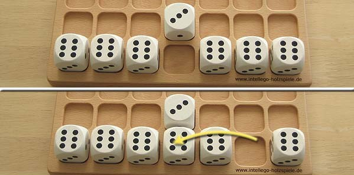
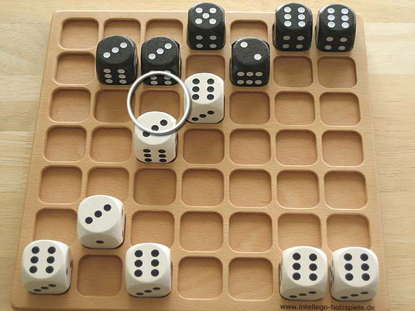

# Cublino Game

## Collaborators
This project was made by Akshat Jain, Justin Tieu and Chris Kim. The code was made collaboratively across many domains.

## Game Rules
Cublino is a two player game where each player controls seven dice. Players alternate turns moving their dice attempting to reach the opponent's end of the board. There are two variants of the rules: Cublino Contra and Cublino Pur. Each variant has slightly different rules and winning conditions. For the main task of the assignment you will be implementing the Cublino Pur variant, with an option to implement Cublino Contra as an additional task at the end of the assignment. All images used in this section are taken from [https://www.brettspiele-report.de/cublino/](https://www.brettspiele-report.de/cublino/).

## Game setup

The game is set up with each player placing their seven dice on their respective ends of the board with the six facing up and the three facing towards themselves (and the four facing the towards the opponent). Both variants are set up in the same way.

### Playing the Game

#### Cublino Pur

In Pur, on a player's turn they select one die to move. They may then move that dice in a sequence of steps which make up the move. There are two types of steps: 
 - A tipping step where the die is tilted along its edge either forwards or horizontally. The die should be rotated 90 degrees in the direction of the step such that a new number is facing upwards.

   
 - A jumping step, where the die jumps over another singular die either immediately forwards, left, or right. The die is not rotated through a jumping step. If the space behind the adjacent die is not empty the player may not jump in that direction.

Steps are combined into moves as follows:
 - A move must consist of at least one step.
 - Only the first step in a move may be a tipping step, however, the first step in a move doesn't need to be a tipping step. If the player chooses to make a jumping step first then they may only make jumping steps for the rest of the move.

|  |
| :---: |
| A move starting and continuing with a sequence of jumping steps. |

|  |
| :---: |
| A move starting with a tipping step followed by a sequence of jumping steps. |

Once a player has completed the series of steps making up their move the turn is passed to the other player. If a player has no legal moves their turn is skipped and the other player must make another move. If no player has legal moves available, and the game is not finished the result is a draw (see the next section for the rules to finishing a game).

##### Finishing the Game

A game of Cublino Pur is over once a player has reached the opponent's end of the board with all seven of their dice. Each player then adds the upward facing numbers on their dice which have reached the opponent's end of the board (any dice which are not at the opponent's end of the board are excluded from the total). The player with the higher total wins.

|  |
| :---: |
| In this example the white player scores 26 and the black player scores 25. |

#### Cublino Contra

In Contra players move by tipping their dice along an edge either forwards, left or right. In Contra all move consist of a single tipping step, jumping steps are not permitted. If the moved dice is adjacent to the opponent's dice after the move a battle occurs. A battle is resolved by adding the numbers on the upwards faces of all adjacent dice belonging to the opponent of the two dice in the battle. Two dice are considered adjacent if they are directly touching along one side (So a dice can be adjacent to up to four other dice). The player with the lower score loses the battle and their dice is removed. If the totals are equal no dice are removed as a result from the battle. For example, if white has just move a die (the attacker), and it is adjacent to a black die (the defender) then white's score in the battle is calculated by adding the numbers on the top faces of all white dice adjacent to the defending black die and black's score is calculated by adding the numbers on the top faces of all black die ajdacent to the attacking white die. Only the attacking or defending dice are removed, not any others which contributed to the total. If a moved dice is adjacent to more than one opponent's dice multiple battles occur. The outcome of each battle is determined separately before any dice have been removed. Once all battles have been resolved the losing dice are removed.

|  |
| :---: |
| White moves the die as shown and is now adjacent to a black die. White's total is six and black's total is three. Black loses the battle and their dice is removed.

|  |
| :---: |
| Black moves the die as shown and is now adjacent to a white dice. The total for both players is six so no dice are removed.

|     |
| :---: |
| White moves the die as shown. White's total is nine (6 + 3) and black's total is six. Black loses and their dice is removed.

|  |
| :---: |
| The battle marked 1 is tied so no dice are removed. In the battle marked 2 white's total is six and black's total is nine so the white dice would be removed. |

If a player has no legal moves their turn is skipped and the other player must make another move. If no player has legal moves available, and the game is not finished the result is a draw (see the next section for the rules to finishing a game).

##### Finishing the Game

The first player who reaches the opponent's end of the board with one of their dice wins the game.

#### Never Ending Game

In both variants it is possible for the game to last forever, for example if both players just move a dice horizontally back and forth without moving forwards. The tasks of the assignment do not consider this scenario however as part of task 14 you may introduce a rule to check when players are stalling the game and end the game with a draw. How you define this is up to you (should you choose to implement it) as long as it does not conflict with the existing rules as stated above.

